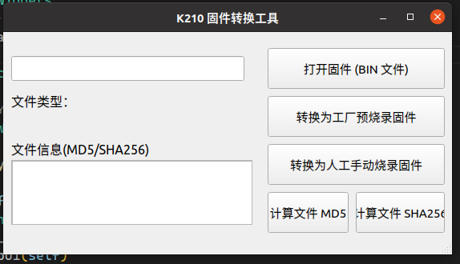

# MF_FirmwareTool 细节描述

## 界面 &&功能描述



### 功能 TODO：

MF 固件工具

基础功能：

[x] 区分是否为预烧录固件
- [x] K210 原始固件与 FLASH 预烧录固件
- [x] K210 固件与非 K210 固件区分

[-] 预烧录固件与非预烧录固件相互转换

- [x] 原始固件转预备烧录固件
- [x] 预烧录固件转原始固件

[x] 支持文件校验：MD5/SHA256 校验

[] 多个 kfpkg 与 bin 混合合并

## K210 固件细节描述

K210 编译的固件(原始固件)前 6 个字节为标记字节：[0x21 0xA8 0xEF 0xBE 0xAD 0xDE]

而在实际中，使用串口烧录 K210 固件到 flash 中，K210 将在固件的头部和尾部添加相应的校验信息，确保固件完整。

| 固件描述 | 起始地址 | 占用大小（字节）| 备注 |
| --- | --- | --- | --- |
| 头部校验信息 | 0x00 | 5Byte | aseflag(0x00)+固件大小(4byte)  |
| 固件内容(原始固件) | 0x00 | 6Byte | MagicFlag |
| 尾部信息 | --- | 32Byte | SHA256 |
## pyinstaller 打包

安装打包工具

```shell
pip3 install -i https://pypi.tuna.tsinghua.edu.cn/simple pyinstaller
```

使用 pyinstaller 打包为单一可执行程序

```shell
pyinstaller -Fw main.py
```
